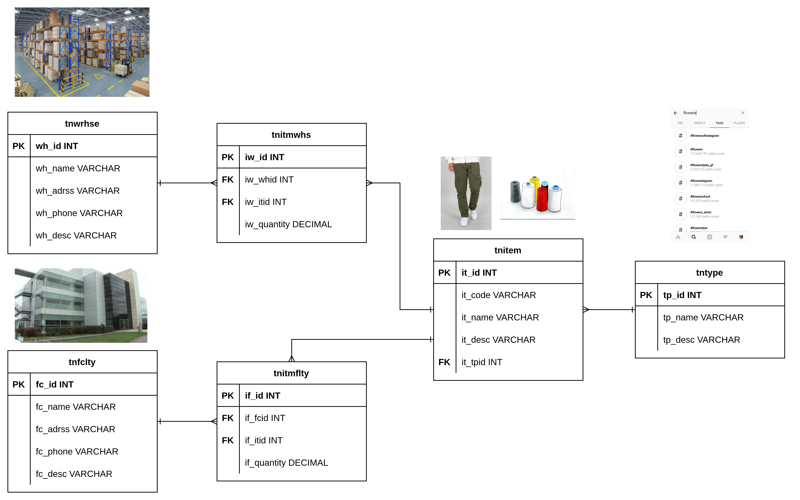
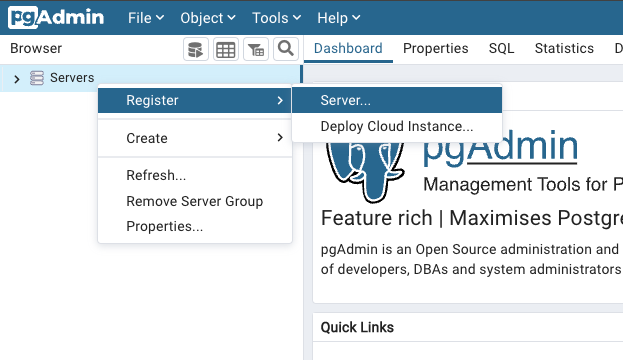
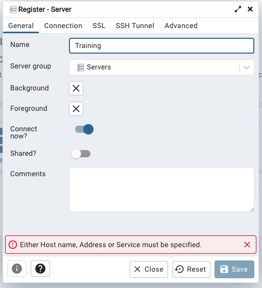
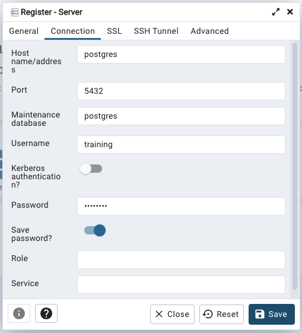
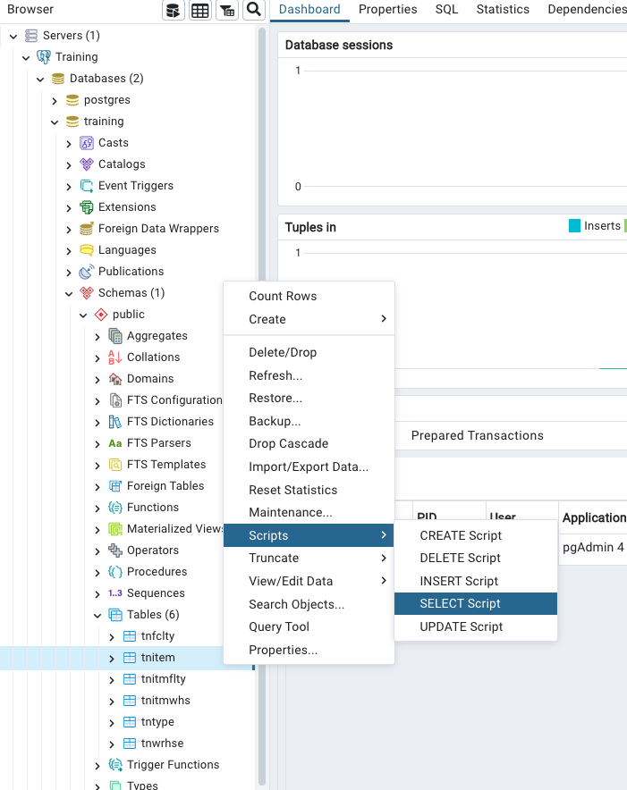
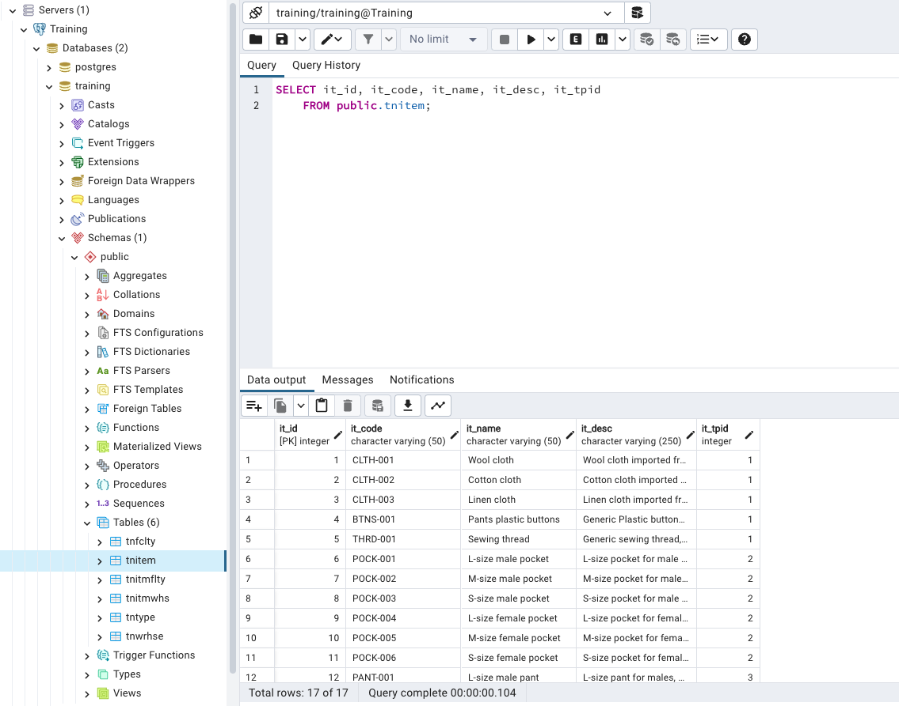

# Training repo

## Rules

To start working with the project, you should follow these rules:

- Never make changes to the master branch
- All your changes should be inside your own branch
- Every commit should the correspondent ticket Id (Check [User Stories](./user_stories.md))

## Tables relations

The following image shows the relations between the tables in the database.



The entities are:
- Warehouses
- Facilities
- Items
- Item types

## Code setup

Go to src/DeacomTraining/Data/Connections and change the connection string to your local database, if you are using MSServer change the DbConnection.cs, of you are using postgres change the DbConnectionPG.cs (leave it as it is if you are using the docker-compose file).:

```csharp
//-- change this with your connection string
private readonly string _connectionString =
    "Data Source=RALARCONV-NH01;Initial Catalog=DeacomTraining;Trusted_Connection=True;";
```

Then, go to src/DeacomTraining/Config and change to the corresponding database type:

```csharp
public static class Config
{
    public static DBTypes DBType = DBTypes.SQLServer; //-- Change this
}
```

## Setup the DB using postgres and docker

To setup the DB using docker and postgres, first make sure to have docker and docker-compose installed.

- [Install docker](https://docs.docker.com/engine/install/)
- [Install docker-compose](https://docs.docker.com/compose/install/)

Then, run the following command to setup the DB.

Once you have docker installed, run the following command to start the DB.

    $ docker-compose up -d

    Once the containers are running, you can access pgAdmin4 by going to http://localhost:5050/

    * In order to recreate the database, delete the containers and the docker volumes used to store the database.

    $ docker-compose down -v

    (If needed) Check for the containers:

    $ docker ps -a

    If you see the containers, you can delete them with the following command:

    $ docker-compose rm -f <the first characters of the container ID>

    Check for the volumes:

    $ docker volume ls

    If you see the volumes, you can delete them with the following command:

    $ docker volume rm <the first characters of the volume ID>

### PgAdmin4

Once the containers are running, go to http://localhost:5050/ and login with the following credentials:

    * Email: training@training.com
    * Password: training

Once you are logged in, you can register a new server. Go to Server -> Register -> Server...



In the new window, fill the form with the following information:

Name: Training (Could be anything)
<br/>


Hostname/Address: postgres <br/>
Maintenance DB: postgres <br/>
Username: training <br/>
Password: training <br/>


Once you have registered the server, navigate as follows:

Training -> Databases -> training -> Schemas -> Tables <br/>
Right click and go to Scrips -> SELECT Script <br/>


Execute the query hitting the "play" button, and validate the information is correct.


You are done!

